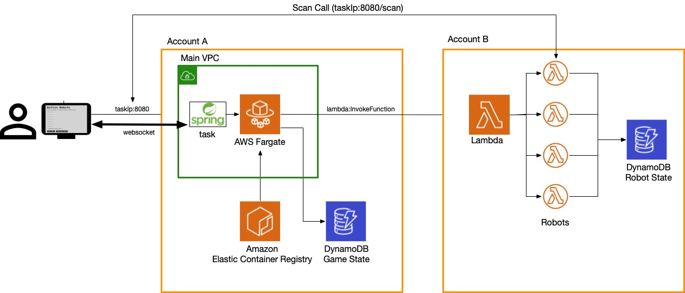
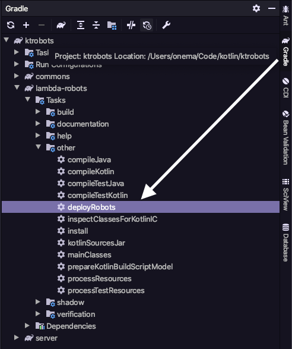
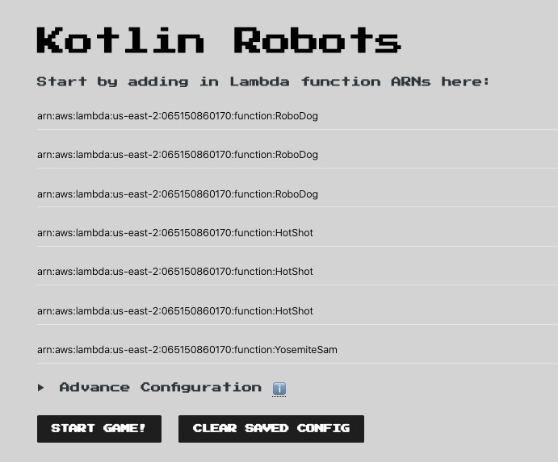
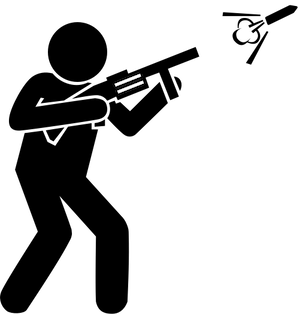
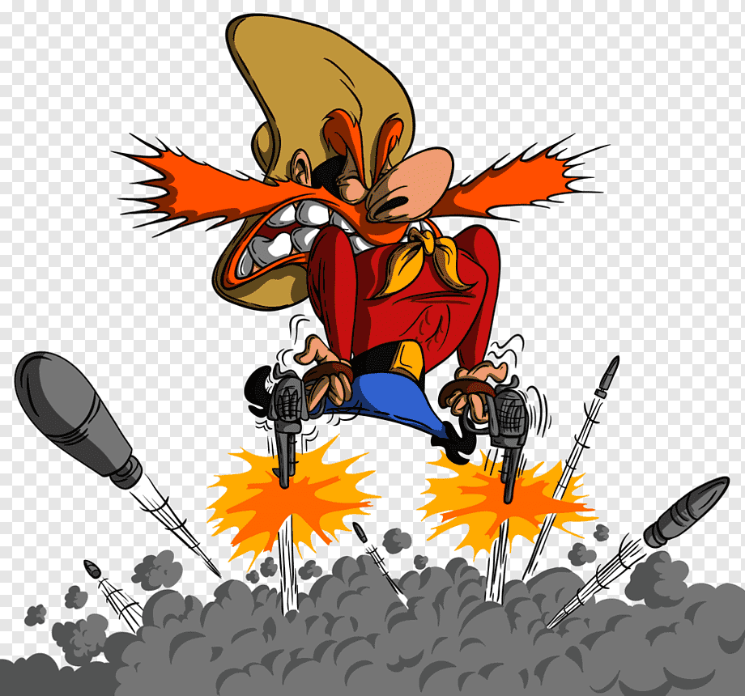
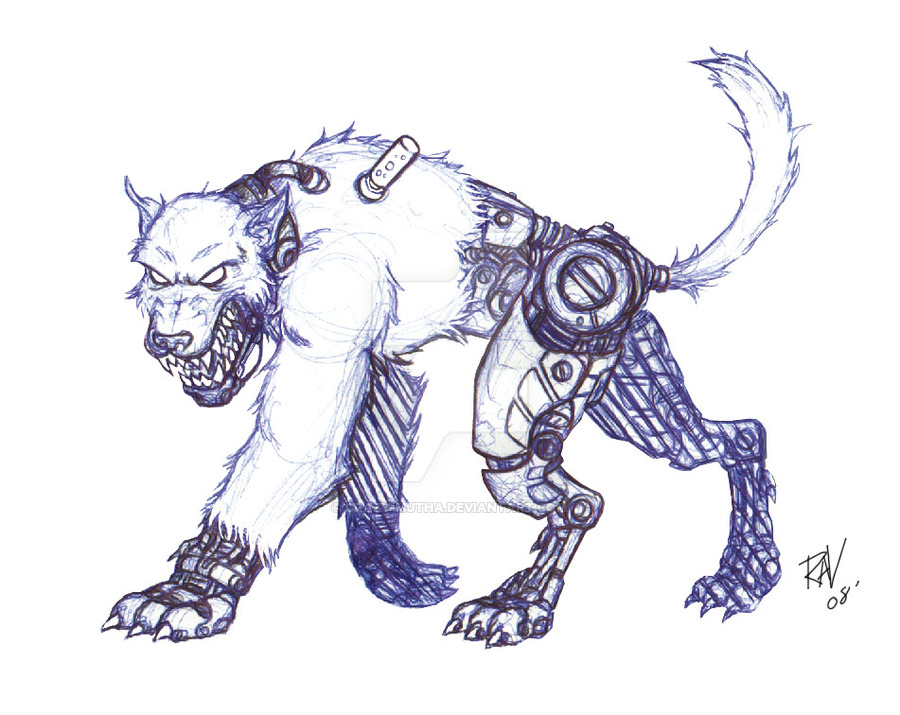
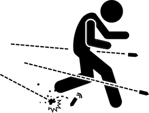
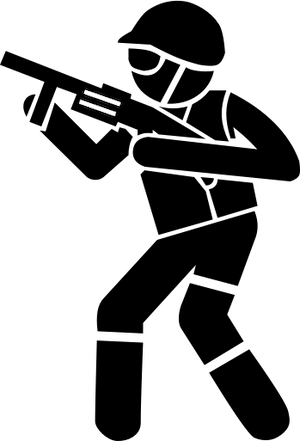

# KT-Robots

> **KT-Robots is a port of the [λ-Robots](https://github.com/LambdaSharp/LambdaRobots) Team Hackathon Challenge.**
> 
> The original idea can be traced back to the 70s [RobotWar](https://corewar.co.uk/robotwar.htm). 
> 
> This repository is an implementation of the game in the [kotlin](https://kotlinlang.org/) programming language and the [spring framework](https://spring.io/).

KT-Robots is a Team Hakcathon programming challenge build using serverless technologies.

In KT-Robots, you program a battle robot that participates in a square game field. Each turn, the server invokes your robot's Lambda function to get its action until the robot wins or is destroyed.



 
## Level 0: Setup

<details>
<summary>Install tools & setup code</summary>

### Install the required tools
Make sure that you have the following tools installed on your computer.
<details>
<summary>List of required tools</summary>

- [Download and install the JDK 11](https://www.oracle.com/java/technologies/javase-jdk11-downloads.html)
- [Download and install the AWS CLI](https://docs.aws.amazon.com/cli/latest/userguide/install-cliv2.html)
- [Download and install the serverless framework](https://www.serverless.com/framework/docs/providers/aws/guide/installation/)
</details>

### Setup AWS Account and CLI
The challenge requires an AWS account. AWS provides a [*Free Tier*](https://aws.amazon.com/free/), which is sufficient for the challenge.
<details>
<summary>Setup Instructions</summary>

- [Create an AWS Account](https://aws.amazon.com)
- [Configure your AWS profile with the AWS CLI for us-east-1](https://docs.aws.amazon.com/cli/latest/userguide/cli-chap-configure.html#cli-quick-configuration)
</details>

> **NOTE:** 
> 
> For this challenge we will be using the US-EAST-1 region

### Clone Git Challenge Repository
<details>
<summary>Clone command</summary>

Run the following command to clone the KT-Robots challenge. 
```bash
git clone git@github.com:onema/kt-robots.git
cd kt-robots
```
</details>
</details>

## Level 1: Deploy functions and server
<details>
<summary>Deploy lambda functions and server</summary>
 
### Deploy using CloudFormation and the Serverless Framework
From the command line use `gradlew` to run the `deploy-robots` task: 
```bash
./gradlew deploy-robots
```
<details>
<summary>Details</summary>

This task will 
- Compile the `lambda-robots` project
- Deploy the Lambda functions to your AWS account in the `us-east-1` region using the Serverless framework
</details>

<details>
<summary>Use the InjelliJ Gradle Plugin</summary>

Or use the IntelliJ Gradle plugin to execute the task.


</details>


Once the command has finished running, the output shows you the ARN of the lambda robots.
```bash
functions:
  BringYourOwnRobot: kotlin-robots-dev-BringYourOwnRobot
  YosemiteSam: kotlin-robots-dev-YosemiteSam
  HotShot: kotlin-robots-dev-HotShot
  RoboDog: kotlin-robots-dev-RoboDog
  TargetRobot: kotlin-robots-dev-TargetRobot
```

The `BringYourOwnRobot` is the robot you will be working on!

> **NOTE:** 
> 
> Open `lambda-robots/src/main/kotlin/io.onema.ktrobots.lambda/functions/BringYourOwnRobot` and customize the field `NAME` of your robot to distinguish it from other robots.

### Deploy the game server using CloudFormation 
From the command line use `gradlew` to run the `deploy-server` task:
```bash
./gradlew deploy-server
```
<details>
<summary>Details</summary>

This task performs the following actions:

- Compile the server
- Deploy the game server to your AWS account in the `us-east-1` region using CloudFormation
- Creates a docker image that runs the server
- Create an ECR docker repository to host the image
- Pushes the image to the new docker repository
- Creates a Fargate cluster
- Creates a service and runs a task exposing port 80

</details>

<details>
<summary>Getting the task IP Address</summary>
Once the deployment has finished, you have to log in to AWS to get the server IP:
- Amazon ECS
- Clusters
- ktrobots-server-cluster
- Tasks
- Select the task from the list
- Copy the Public IP
- You can also expand the task details and get a link to the CloudWatch logs

Once you have the IP paste it in your browser.
```bash
# For example
http://3.1.11.111/
```
</details>

<details>
<summary>Adding robots to game board</summary>

You can add the robot lambda function ARN to the game board client in the browser.  **You can add the ARN multiple times.**



Use the **Advance Configuration** to change any default settings.  Use **Clear Saved Config** to reset all settings to default.
</details>
</details>

## Level 2: Select Robot Build

<details>
<summary>Build your robot with the right equipment</summary>

The default server settings allow each robot to have `8` build points. You can spend your points in the following equipment:

| Equipment type | Description                                                                                                        |
| -------------- | ------------------------------------------------------------------------------------------------------------------ |
| engine         | Modify your robots speed and acceleration                                                                          |
| armor          | Protect your robot against missile and collision damage. Heavier armor will affect your speed and acceleration     |
| missile        | Missiles your robot can shoot. These have different velocity, damage points, ranges, blast radius and reload times |
| radar          | Allow your robot to detect enemies for a given distance and angle of view                                          |

To customize your robot build, open the `BringYourOwnRobot` function and update the values in the `LambdaRobotBuild` method. 
For additional details on the different equipment types see the [Robot Build](/docs/programming-reference.md#robot-build) section in the [Programming Reference](/docs/programming-reference.md). 

> **NOTE:** 
> 
> If you go over the allotted number of points, your robot will be immediately disqualified

</details>

## Level 3: Create an Attack Strategy


<details>
<summary>Develop your attack strategy</summary>

### Develop (or Copy) an Attack Strategy
Now that you have deployed all the robots to your account add the ARN of the `TargetRobot` multiple times to the KT-Robots server to create targets.


Update the behavior of `BringYourOwnRobot` to shoot down the target robots. 

### Use Luck - YosemiteSam 
For example, you can use luck, like `YosemiteSam`, which shoots in random directions.



<details>
<summary>YosemiteSam Details</summary>

Yosemite Sam is fast and trigger happy!

This robot chooses a random angle on every turn and fires a missile. It has an extra-large engine that helps avoid attacks and keeps its distance from the edges of the game board to avoid collisions!

| Equipment | Type              | Points | Details |
| --------- | ----------------- | ------ | ------- |
| Armor     | Light             | 1      |         |
| Engine    | Extra Large       | 4      |         |
| Radar     | Ultra Short Range | 0      |         |
| Missile   | Dart              | 0      |         |
| Total     |                   | 5      |         |
</details>


### Use Targeting - HotShot 
This robot uses the `scan()` method to find enemies and aim missiles at them. 


<details>
<summary>HotShot Details</summary>

HotShot is patient and accurate; it hardly ever misses its target!

This robot uses the `scan()` method to find targets. If it doesn't find targets, it moves to a new location. If it receives damage, it initiates an evasive move. 

| Equipment | Type        | Points | Details |
| --------- | ----------- | ------ | ------- |
| Armor     | Medium      | 2      |         |
| Engine    | Large       | 3      |         |
| Radar     | Short Range | 1      |         |
| Missile   | Javelin     | 2      |         |
| Total     |             | 8      |         |
</details>

### Chase like a dog - RoboDog 

This robot uses the `scan()` method to find enemies and chases them causing collision damage.



<details>
<summary>RoboDog Details</summary>

RoboDog moves at random and scans what is right in front of it. When this dog bites, it won't let go!

This robot uses the `scan()` method to find targets right in from of it. If it does it adjust it's heading to move towards the target, this dog can hit you with a missile and with collision damage!

| Equipment | Type              | Points | Details |
| --------- | ----------------- | ------ | ------- |
| Armor     | Light             | 2      |         |
| Engine    | Standard          | 3      |         |
| Radar     | Ultra Short Range | 0      |         |
| Missile   | Cannon            | 3      |         |
| Total     |                   | 8      |         |
</details>

### TargetRobot 

This robot just sits down and waits to be hit. 


<details>
<summary>TargetRobot Details</summary>

Please don't be the target robot, and nobody wants to be the target robot!

| Equipment | Type              | Points | Details |
| --------- | ----------------- | ------ | ------- |
| Armor     | Heavy             | 3      |         |
| Engine    | Economy           | 0      |         |
| Radar     | Ultra Short Range | 0      |         |
| Missile   | Dart              | 0      |         |
| Total     |                   | 3      |         |
</details>


### Remember that 
- Other robots may be out of radar range, requiring your robot to move periodically. 
- Your robot can be damaged by its own missiles. 
- Check `gameInfo.farHitRange` to make sure your target is beyond the damage range. 
- If you don't mind a bit of self-inflicted pain, you can also use `gameInfo.nearHitRange` or even `game.directHitRange` instead.
</details>

## Level 4: Create an Evasion Strategy


<details>
<summary>Develop your evasion strategy</summary>
 
Add the `YosemiteSam` ARN twice to the KT-Robots server to create two attackers.

Now update the behavior of `BringYourOwnRobot` to avoid getting shot. 

<details>
<summary>Examples</summary>

You can be in continuous motion, like `YosemiteSam`, which zig-zags across the board, react to damage like `HotShot`,  or chase and ram into your opponents like `RoboDog`.

Beware that a robot cannot change heading without suddenly stopping if its speed exceeds `Robot.MaxSpeed`.
</details>
</details>

## Level 5: Take on the Champ


<details>
<summary>Test if your robot is good enough</summary>

Add the `HotShot` ARN once to the KT-Robots server to create one formidable opponent.

Consider tuning one more time your robots build by updating the equipment
- engine
- armor
- missile
- radar

> 🎯 **Set the proper equipment to suit your attack and evasion strategies.**
 
>⚠️ **Remember that your build cannot exceed 8 points or your robot will be disqualified from the competition.**

</details>


## BOSS LEVEL: Enter the Multi-Team Deathmatch Competition


<details>
<summary>Test if your robot is the best</summary>


For the boss level, your opponent is every other team! Submit your robot ARN and see how well it fares.

Before submitting your ARN for the competition, allow access to invoke your function:
```bash
aws lambda add-permission --function-name "YOUR FUNCTION ARN GOES HERE" --action lambda:InvokeFunction --statement-id kt-robots-invoke-function --principal '*' --region us-east-1  
```

**May the odds be ever in your favor!**
</details>

# DON'T FORGET TO CLEAN UP 💸!

The ECS Fargate task run on spot instances and this is the cost for running the server:

- 512 vCPU $0.00639685 per hour
- 1024 MiB $0.00140484 per hour

While it will cost you cents to run this task for a few hours, you want to turn it off after you are done with the challenge.
Use the following commands to destroy all the resources:

```bash
./gradlew delete-robots
./gradlew delete-server
```
