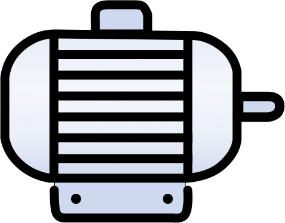
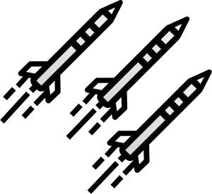
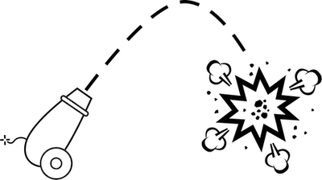
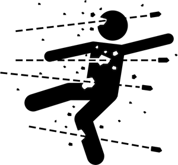

# Programming Reference

## Pre-Build Lambda-Robots

The `lambda-robots/src/main/kotlin/io.onema.ktrobots.lambda/functions/` folder contains additional robots that are deployed, these have different behaviors.
Next, we need a few robots to battle it out.
* `TargetRobot`: This is a stationary robot for other robots to practice on.
* `YosemiteSam`: This robot runs around shooting in random directions as fast as it can.
* `HotShot`: This robot uses its radar to find other robots and fire at them. When hit, this robot moves around the board.
* `RoboDog`: This robot moves around shooting straight in front of it, when it finds a target it changes direction and chasses it, this robot will do collision damage.

## LambdaRobots SDK

Derive your Lambda-Robot from the `LambdaRobotFunction` provided by the SDK.

### Abstract Methods
The base class requires two methods to be implemented:

| Method                                                                              | Description                                                                                                                                                                                                                                                    |
| ----------------------------------------------------------------------------------- | -------------------------------------------------------------------------------------------------------------------------------------------------------------------------------------------------------------------------------------------------------------- |
| `fun getBuild(state: LambdaRobotState): Pair<LambdaRobotBuild, LambdaRobotState>`   | This method returns the robot build information, including its name, armor, engine, missile, and radar types, and the robot state object. Note that a build cannot exceed 8 points by default, or the robot will be disqualified at the beginning of the match.
| `fun getAction(state: LambdaRobotState): Pair<LambdaRobotAction, LambdaRobotState>` | This method returns the actions taken by the robot during the turn and the updated robot state                                                                                                                                                                 |

### Properties
The most commonly needed properties are readily available as properties from the base class. Additional information about the game or the robot is available via the `Game` and `Robot` properties, respectively.

| Property           | Type          | Description                                                                                                                                      |
| ------------------ | ------------- | ------------------------------------------------------------------------------------------------------------------------------------------------ |
| `gameInfo`         | `GameInfo`    | Game information data structure. _See below._                                                                                                    |
| `robot`            | `LambdaRobot` | Robot information data structure. _See below._                                                                                                   |

#### `Robot` Properties
| Property                      | Type                | Description                                                                               |
| ----------------------------- | ------------------- | ----------------------------------------------------------------------------------------- |
| `arn`                         | `string`            | Robot invokation identifier, either the AWS Lambda ARN or class namespace + class name.   |
| `id`                          | `string`            | Globally unique robot ID.                                                                 |
| `index`                       | `int`               | Index position of robot. Starts at `0`.                                                   |
| `name`                        | `string`            | Robot display name.                                                                       |
| `status`                      | `LambdaRobotStatus` | Robot status. Either `alive` or `dead`.                                                   |
| `x`                           | `double`            | Robot horizontal position.                                                                |
| `y`                           | `double`            | Robot vertical position.                                                                  |
| `heading`                     | `double`            | Robot heading. Between `0` and `360`. (degrees)                                           |
| `maxDamage`                   | `double`            | Maximum damage before the robot is destroyed.                                             |
| `maxSpeed`                    | `double`            | Engine Maximum speed - armor speed modifier for robot. (m/s)                              |
| `isAlive()`                   | `boolean`           | True if the status == LambdaRobotStatus.alive else false                                  |
| `canFire()`                   | `boolean`           | True if the reloadCoolDown == 0 else false                                                |
| `addDamageDealt()`            | `LambdaRobot`       | Increments the count to the totalDamageDealt                                              |
| `addHit()`                    | `LambdaRobot`       | Increments the count to the totalMissileHitCount                                          |
| `maxTurnSpeed`                | `double`            | Maximum speed at which the robot can change heading without a sudden stop. (m/s)          |
| `speed`                       | `double`            | Robot speed. Between `0` and `engine.maxSpeed`. (m/s)                                     |
| `reloadCoolDown`              | `double`            | Number of seconds before the robot can fire another missile. (s)                          |
| `targetHeading`               | `double`            | Desired heading for robot. The heading will be adjusted accordingly every turn. (degrees) |
| `targetSpeed`                 | `double`            | Desired speed for robot. The current speed will be adjusted accordingly every turn. (m/s) |
| `timeOfDeathGameTurn`         | `int`               | Game turn during which the robot died. `-1` if robot is alive.                            |
| `totalCollisions`             | `int`               | Number of collisions with walls or other robots during match.                             |
| `totalDamageDealt`            | `double`            | Damage dealt by missiles during match.                                                    |
| `totalKills`                  | `int`               | Number of confirmed kills during match.                                                   |
| `totalMissileFiredCount`      | `int`               | Number of missiles fired by robot during match.                                           |
| `totalMissileHitCount`        | `int`               | Number of missiles that hit a target during match.                                        |
| `totalTravelDistance`         | `double`            | Total distance traveled by robot during the match. (m)                                    |
| `damage`                      | `double`            | Accumulated robot damage. Between `0` and `MaxDamage`.                                    |
| `armor.deceleration`          | `double`            | Deceleration when speeding up. (m/s^2)                                                    |
| `armor.collisionDamage`       | `double`            | Amount of damage the robot receives from a collision.                                     |
| `armor.directHitDamage`       | `double`            | Amount of damage the robot receives from a direct hit.                                    |
| `armor.farHitDamage`          | `double`            | Amount of damage the robot receives from a far hit.                                       |
| `armor.nearHitDamage`         | `double`            | Amount of damage the robot receives from a near hit.                                      |
| `engine.acceleration`         | `double`            | Acceleration when speeding up. (m/s^2)                                                    |
| `engine.maxSpeed`             | `double`            | Maximum speed for robot. (m/s)                                                            |
| `missile.directHitDamageBonus`| `double`            | Bonus damage on target for a direct hit.                                                  |
| `missile.farHitDamageBonus`   | `double`            | Bonus damage on target for a far hit.                                                     |
| `missile.nearHitDamageBonus`  | `double`            | Bonus damage on target for a near hit.                                                    |
| `missile.range`               | `double`            | Maximum range for missile. (m)                                                            |
| `missile.reloadCooldown`      | `double`            | Number of seconds between each missile launch. (s)                                        |
| `missile.velocity`            | `double`            | Travel velocity for missile. (m/s)                                                        |
| `radar.maxResolution`         | `double`            | Maximum degrees the radar can scan beyond the selected heading. (degrees)                 |
| `radar.range`                 | `double`            | Maximum range at which the radar can detect an opponent. (m)                              |

#### `GameInfo` Properties
| Property         | Type     | Description                                             |
| ---------------- | -------- | ------------------------------------------------------- |
| `boardWidth`     | `double` | Width of the game board.                                |
| `boardHeight`    | `double` | Height of the game board.                               |
| `secondsPerTurn` | `double` | Number of seconds elapsed per game turn.                |
| `directHitRange` | `double` | Distance for missile impact to count as direct hit.     |
| `nearHitRange`   | `double` | Distance for missile impact to count as near hit.       |
| `farHitRange`    | `double` | Distance for missile impact to count as far hit.        |
| `collisionRange` | `double` | Distance between robots to count as a collision.        |
| `gameTurn`       | `int`    | Current game turn. Starts at `1`.                       |
| `maxGameTurns`   | `int`    | Maximum number of turns before the game ends in a draw. |
| `maxBuildPoints` | `int`    | Maximum number of build points a robot can use.         |
| `apiUrl`         | `string` | URL for game server API.                                |

#### `LambdaRobotAction` Properties
| Property              | Type     | Description                                               |
| --------------------- | -------- | --------------------------------------------------------- |
| `speed`               | `double` | Update the robot speed up to `engine.maxSpeed`.           |
| `heading`             | `double` | Update the robot heading.                                 |
| `fireMissileHeading`  | `double` | Heading of a new fired missile.                           |
| `fireMissileDistance` | `double` | Distance a fired missile can travel up to `missile.range`.|
| `fired`               | `boolean`| Whether a missile was fired or not.                       |
| `arrivedAtDestination`| `boolean`| Whether or not the robot arrived at it's destination.     |

### Primary Methods
The following methods represent the core capabilities of the robot. They are used to move, fire missiles, and scan their surroundings.

| Method                                       | ReturnType           | Description                                              |
| -------------------------------------------- | -------------------- | -------------------------------------------------------- |
| `scan(heading: Double, resolution: Double)`  | `ScanEnemiesResponse`| Scan the game board in a given deading and resolution. The resolution specifies in the scan arc centered on `heading` with +/- `resolution` tolerance. The max resolution is limited to `Robot.RadarMaxResolution`.|
| `angleToXY(x: Double, y: Double)`            | `Double`             | Determine the angel in degrees relative to the current robot position. Returns a value between -180 and 180 degrees.|
| `distanceToXY(x: Double, y: Double)`         | `Double`             | Determine the distance to X, Y relative to the current robot position.|
| `normalizeAngle(angle: Double)`              | `Double`             | Normalize angle to be between -180 and 180.|
| `getNewHeading(minDistanceToEdge: Int = 100)`| `Int`                | Check if the robot needs to turn based on a minimum distance to the edge and return a new heading if it does.|

### Support extension functions
The following methods are available to make some operations easier:

| LambdaRobotAction Extension Functions                               | ReturnType         | Description                                              |
| ------------------------------------------------------------------- | ------------------ | -------------------------------------------------------- |
| `LambdaRobotAction.fireMissile(heading: Double, distance: Double)`  | `LambdaRobotAction`| Fire a missile in a given direction with impact at a given distance. A missile can only be fired if `Robot.ReloadCoolDown` is `0`. |
| `LambdaRobotAction.fireMissileToXY(x: Double, y: Double)`           | `LambdaRobotAction`| Convenience function to fire a missile at a specific set of coordinages.|
| `LambdaRobotAction.moveToXY(x: Double, y: Double)`                  | `LambdaRobotAction`| Convenience method to move the robot to a specific location.     |

| LambdaRobotState Extension Functions                               | ReturnType         | Description                                              |
| ------------------------------------------------------------------ | ------------------ | -------------------------------------------------------- |
| `LambdaRobotState.initialize()`                                    | `LambdaRobotState` | Convenience function to set the state to initialized.    |

## Robot Build

**By default, 8 build points are available to allocate in any fashion. The robot is disqualified if its build exceeds the maximum number of build points.**

### Radar

| Radar Type       | Radar Range  | Radar Resolution | Points |
| ---------------- | ------------ | ---------------- | ------ |
| ultraShortRange  | 200 meters   | 45 degrees       | 0      |
| shortRange       | 400 meters   | 20 degrees       | 1      |
| midRange         | 600 meters   | 10 degrees       | 2      |
| longRange        | 800 meters   | 8 degrees        | 3      |
| ultraLongRange   | 1,000 meters | 5 degrees        | 4      |

### Engine

| Engine Type      | Max. Speed | Acceleration | Points |
| ---------------- | ---------- | ------------ | ------ |
| economy          | 60 m/s     | 7 m/s^2      | 0      |
| compact          | 80 m/s     | 8 m/s^2      | 1      |
| standard         | 100 m/s    | 10 m/s^2     | 2      |
| large            | 120 m/s    | 12 m/s^2     | 3      |
| extraLarge       | 140 m/s    | 13 m/s^2     | 4      |

### Armor

| Armor Type     | Direct Hit | Near Hit | Far Hit | Collision | Max. Speed | Deceleration | Points |
| -------------- | ---------- | -------- | ------- | --------- | ---------- | ------------ | ------ |
| ultraLight     | 50         | 25       | 12      | 10        | +35 m/s    | 30 m/s^2     | 0      |
| light          | 16         | 8        | 4       | 3         | +25 m/s    | 25 m/s^2     | 1      |
| medium         | 8          | 4        | 2       | 2         | -          | 20 m/s^2     | 2      |
| heavy          | 4          | 2        | 1       | 1         | -25 m/s    | 15 m/s^2     | 3      |
| ultraHeavy     | 2          | 1        | 0       | 1         | -45 m/s    | 10 m/s^2     | 4      |

### Missile

When shooting a missile a heading and a range must be set. Depending on the missile, the range cannot exceed the Max. Range.
Each missile causes damage only when it reaches its set range, none otherwise. When a missile explodes it can cause up to three types of damage:

| **Shooting**                    | **Direct hit damage**                             | **Near hit damage**                            | **Far hit damage**                           |
| ------------------------------- | ------------------------------------------------- | ---------------------------------------------- | -------------------------------------------- | 
| | |  |  | 

| Missile Type    | Max. Range   | Velocity | Direct Hit Bonus | Near Hit Bonus | Far Hit Bonus | Cooldown   | Points |
| --------------- | ------------ | -------- | ---------------- | -------------- | ------------- | ---------- | ------ |
| dart            | 1,200 meters | 250 m/s  | 0                | 0              | 0             | 0.0 sec    | 0      |
| arrow           | 900 meters   | 200 m/s  | 2                | 1              | 0.5           | 0.5 sec    | 1      |
| javelin         | 700 meters   | 150 m/s  | 6                | 3              | 1             | 1.0 sec    | 2      |
| cannon          | 500 meters   | 100 m/s  | 10               | 8              | 6             | 1.5 sec    | 3      |
| BFG             | 350 meters   | 75 m/s   | 40               | 20             | 10            | 2.0 sec    | 4      |
| sniperRifle     | 1200 meters  | 1750 m/s | 30               | 15             | 0             | 4.0 sec    | 5      |